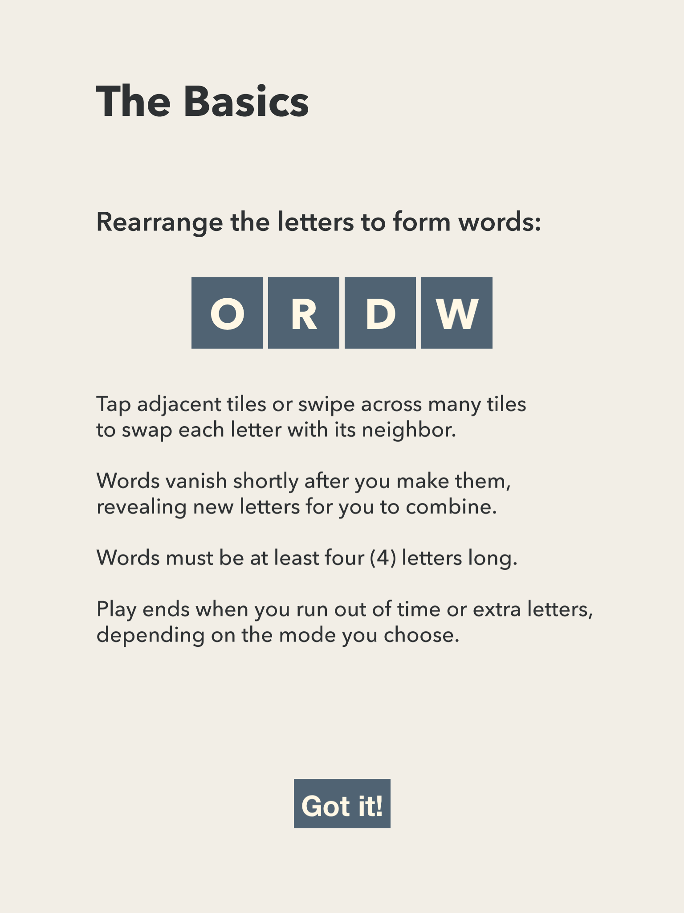
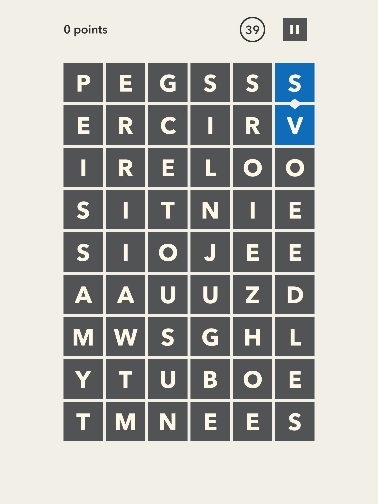

# Wordshift

## History

In 2013, I was deep into indie matching games Triple Town and Legend of Fae. I decided I wanted to make my own match-three style game and got to work. Zach Gage's SpellTower inspired me to mash up the match-three genre with a word game.

I released Word Shift in May 2013 on iOS and it continues to run happily on my iPad from slightly before then. It's no longer on the App Store, but you can have a go at building it for yourself if you're interested.

## This repository

This repository is a quick dump of the source materials for WordShift minus the illustrator files and other large media assets. I haven't tried building the game in years, and beyond requiring an installation of [Cinder](https://libcinder.org/), it likely needs updates to more recent iOS libraries.

## Media

You can check out a gameplay video:
https://www.youtube.com/watch?v=Whiqabovbj0

Or the quick promo trailer:
https://www.youtube.com/shorts/RYOjXFIRNzo

